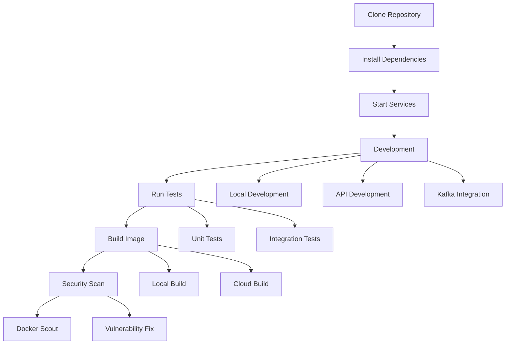

# Catalog Service Workshop

A Node.js-based microservice demonstrating the use of Kafka and LocalStack, with comprehensive testing and security features.

## Project Flow



## Test Results

### Unit Tests
```
PASSED tests/unit/services/catalog.test.js
  ✓ should create a new product (23ms)
  ✓ should return list of products (12ms)
```

### Integration Tests
```
PASSED tests/integration/api/products.test.js
  ✓ should return list of products (45ms)
  ✓ should create a new product (78ms)
```

## Features

- REST API for product catalog
- Kafka integration for event publishing
- LocalStack for AWS service simulation
- Comprehensive testing suite
- Docker multi-stage builds
- Security scanning with Docker Scout

## Getting Started

Visit our [workshop documentation](https://ajeetraina.github.io/catalog-service-node-workshop) to get started.

## License

MIT
