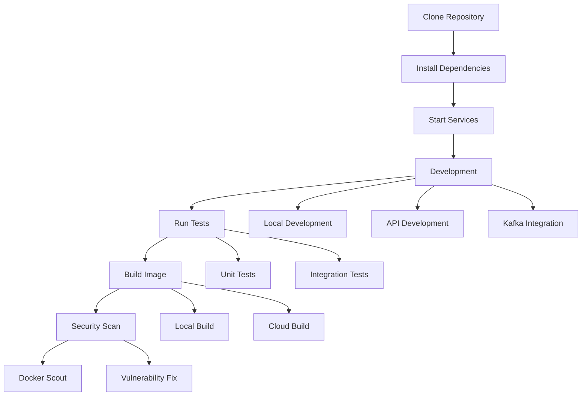

# Catalog Service Workshop

A Node.js-based microservice demonstrating the use of Kafka and LocalStack, with comprehensive testing and security features.

## Project Flow



## Documentation

### Testing the Documentation

To test the documentation locally:

1. Build and start the documentation server:
   ```bash
   docker-compose -f docker-compose.docs.yml up --build
   ```

2. Visit http://localhost:8000 in your browser

3. Run the documentation tests:
   ```bash
   chmod +x scripts/test-docs.sh
   ./scripts/test-docs.sh
   ```

The test script checks:
- Page accessibility
- Navigation structure
- CSS and JavaScript loading
- Code highlighting
- Mermaid diagram rendering

### Documentation Structure

```
docs/
├── develop/         # Development setup and running services
├── test/            # Testing guides and examples
├── build/           # Building and deploying
├── secure/          # Security scanning and best practices
└── index.md         # Home page
```

## Features

- REST API for product catalog
- Kafka integration for event publishing
- LocalStack for AWS service simulation
- Comprehensive testing suite with Testcontainers
- Docker multi-stage builds
- Security scanning with Docker Scout

## Getting Started

Visit our [workshop documentation](https://ajeetraina.github.io/catalog-service-node-workshop) to get started.

## License

MIT
