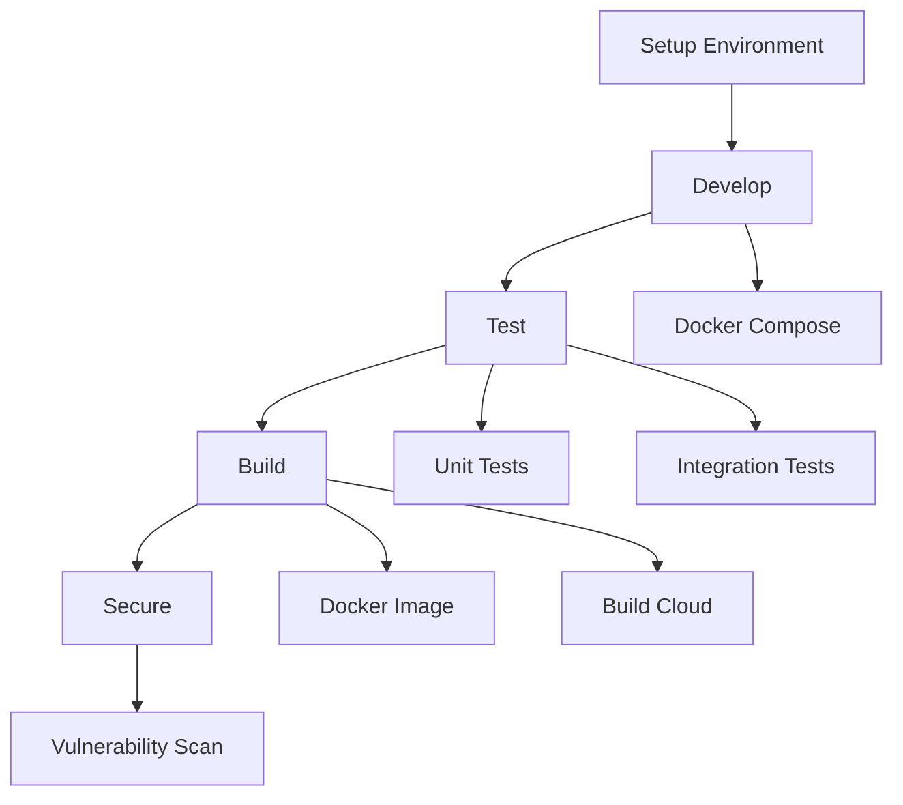

# Catalog Service Workshop

Welcome to the Catalog Service Workshop! This workshop will guide you through developing, testing, building, and securing a NodeJS-based catalog service using Docker.

## Workshop Flow

## Prerequisites

- Docker Desktop (latest version)
- Node.js 16 or higher
- Git
- Text editor of your choice

## What You'll Learn

- Setting up a microservice with Node.js
- Working with Kafka and LocalStack
- Docker Compose for local development
- Testing strategies
- Building and securing Docker images
